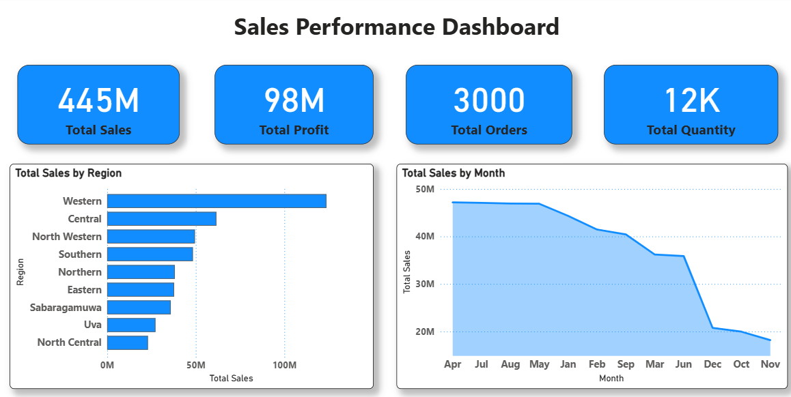

# Power BI Sales Performance Dashboard

An interactive Sales Performance Dashboard built using Microsoft Power BI to analyze sales, profit, orders, products, regions, and salesperson performance.

## Dashboard Preview

## Key Features

- Total Sales and Total Profit analysis
- Total Orders and Quantity tracking
- Monthly sales trends
- Sales by region
- Sales by category
- Top 10 products
- Salesperson performance
- Interactive filters and slicers
- DAX measures
- Power BI data modelling

## Tools & Technologies

- Microsoft Power BI
- DAX
- Microsoft Excel
- Data Modelling

## Files

- `PowerBI_Sales_Dashboard.pbix` – Power BI dashboard
- `PowerBI_Sales_Dashboard_Dataset.xlsx` – Dataset used for the dashboard

## Purpose

This project was created to practice Power BI dashboard development, data modelling, DAX, data visualization, and business analytics.
